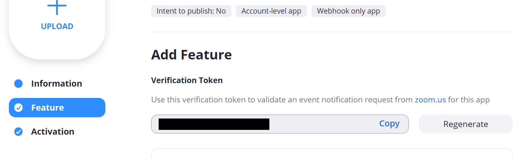

# 概要
本プログラムはZoomの録画情報をZoomのミーティング動画終了をイベントにて検知し  
APIGatewayとLambdaにて受け取り保存された動画をBoxに転送するものです。  

# 設定とインストール
## 2.1 Box側の設定
### 2.1.1 アプリケーション用ユーザーの作成
アプリケーションにてBoxを操作するユーザーを作ってください

### 2.1.2 フォルダの作成
Box上にZoomの録画ファイルを保存するフォルダを作成してください
2.1.1で作成したユーザーにアクセス権限の付与も必要です。

### 2.1.3 Boxアプリケーションの作成
開発者コンソールよりJWT認証のカスタムアプリを作成します
[JWTの設定](https://ja.developer.box.com/guides/applications/custom-apps/jwt-setup/) に従いBoxアプリケーションを作成します  
作成後、アプリケーションを管理者権限にて承認してください。

- Zoomの開発者コンソールを選択してください  


- アプリの新規作成を選びます  


- カスタムアプリを選択します    


- JWTを選択します  


- アプリの名称をきめます  


- 公開鍵を張り付けてください  


- IDが出るのでメモしてください  


- 認証情報をダウンロードします  


## 2.2 Zoomの設定
- [ZoomのApp Marketplace](https://marketplace.zoom.us/develop/create)にアクセスしWebhookOnlyを選択し[Create]をクリック  


- Zoom上でのアプリケーション名を入力し[Create]をクリック  
 

- [Company Name]と[Name]、[Email Address]を入力し[Continue]をクリック   
 

- [Event Subscriptions]を有効にし[SubscriptionName]と[Event notification endpoint URL]を入力します。  [Event notification endpoint URL]は後で書き換えるので実在する適当なWebサイトを入力してください。  Google 辺りで結構です  
 

- Event Typesを追加し[Recording]から[All Recording have completed]  を選択しチェックし[Done]をクリックしてイベントを追加します  
  

- Verification Tokenが発効されるのでメモしてください。



## 2.3 awsの設定
### 2.3.1 パラメーター
リポジトリ上にあるparameter.cfgを編集します  
ここで指定したパラメータはそのままCloudFormation実行時にパラメータとして指定されます。

| パラメータ名| 説明|
| --- | --- |
| PROJECT_NAME | プロジェクト名。CFnのスタックにも使われます。変更の必要はありません |
| S3_BUCKET | CloudFormaionのテンプレートをアップロードするS3バケット名 |
| REGION | awsのリージョン名。必要がなければそのままで大丈夫です |
| ROLE_PATH | IAM Roleのパス名 |
| ZOOM_VERIFICATION_TOKEN | ZoomのVerification Tokenを指定して下さい |
| BOX_CLIENT_ID | ダウンロードしたBoxのjsonファイルからclientIDを張り付けて下さい |
| BOX_CLIENT_SECRET | ダウンロードしたBoxのjsonファイルからclientSecretを張り付けて下さい |
| BOX_ENTERPRISE_ID | ダウンロードしたBoxのjsonファイルからenterpriseIDを張り付けて下さい |
| BOX_JWT_KEY_ID | 公開鍵のIDを張り付けてください |
| BOX_PRIVATE_KEY_ID | ””で囲んで秘密鍵を張り付けてください |
| BOX_FOLDER_ID | 動画アップロード先のBoxのフォルダIDを指定して下さい。</br>BoxのURL上のhttps://domain.app.box.com/folder/{FolderID} |
| BOX_USER | 実行時のBoxのユーザー名を指定して下さい。 |

### 2.3.2 CloudFormationの実行
リポジトリ上のシェルファイル[deploy]を実行するとCloudFormationが開始されます
```
./deploy
```

### 2.3.3 Webhook URLの取得
